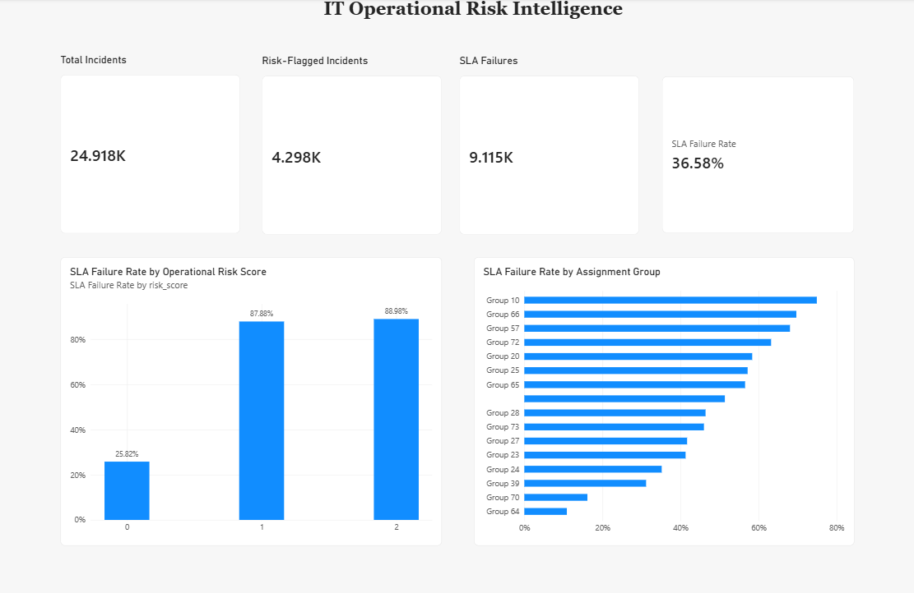

# IT Operational Risk Intelligence

A portfolio project that turns anonymized IT incident-management data into management-oriented operational risk signals and a Power BI decision-support dashboard.

## Project question

**Can everyday IT incident data reveal hidden operational and governance risk signals and help management prioritize areas for investigation?**

This project does **not** claim to reconstruct an enterprise architecture or prove causality. It uses incident workflow patterns as signals that may warrant deeper architecture, governance, process, or service-management investigation.

## What the project does

- Cleans an anonymized ServiceNow-style incident event log.
- Reduces 141,712 update/event rows to 24,918 incident-level records.
- Calculates resolution time and SLA performance.
- Examines reassignment, modification activity, priority, knowledge use, category, and assignment-group patterns.
- Builds a simple operational risk score from workflow-friction signals.
- Exports an incident-level analysis dataset for Power BI.
- Presents management KPIs and risk views in a Power BI dashboard.

## Key findings

- Overall SLA failure rate: **36.58%**.
- Incidents with more than 3 reassignments had an SLA failure rate of about **81%**, versus about **33.5%** for the rest.
- Median resolution time was about **239 hours** for heavily reassigned incidents versus about **16 hours** for other incidents.
- Incidents with more than 10 modifications had an SLA failure rate of about **91.4%**.
- Their median resolution time was about **392 hours**, compared with about **4.7 hours** for incidents with 10 or fewer modifications.
- The combined risk score strongly separated incidents: risk-score 0 incidents had about **25.8%** SLA failure, while scores 1 and 2 were both around **88–89%**.

These are **associations, not causal claims**. The purpose of the score is to prioritize investigation, not automatically diagnose root cause.

## Dashboard

The Power BI dashboard provides four headline KPIs:

- Total Incidents: **24.918K**
- Risk-Flagged Incidents: **4.298K**
- SLA Failures: **9.115K**
- SLA Failure Rate: **36.58%**

It also compares SLA failure by operational risk score and by assignment group, with a minimum-volume filter to avoid overemphasizing tiny groups.



## Risk-score logic

The current risk score is intentionally simple and interpretable:

- More than 3 reassignments: **+1 point**
- More than 10 system modifications: **+1 point**

The score is a management attention signal, not a predictive model.

## Repository structure

```text
IT-Architecture-Risk-Intelligence/
├── main.py
├── IT_Architecture_Risk_Intelligence.pbix
├── dashboard.png
└── README.md
```

The raw and generated CSV files are intentionally not committed to keep the repository lightweight. Running `main.py` on the source incident log produces `incident_risk_analysis.csv`.

## Tools

- Python
- pandas
- NumPy
- Power BI
- DAX

## Why this project matters

The project demonstrates how operational data can be translated into decision-support signals relevant to digital optimization, IT governance, service management, KPI development, and enterprise-architecture discussions. Instead of only reporting incident counts, it highlights workflow patterns that may indicate coordination friction and areas requiring management attention.

## Limitations

- The dataset is anonymized, so categories and assignment groups cannot be interpreted as real organizational units.
- `cmdb_ci` is almost entirely missing, so the analysis cannot map incidents reliably to actual configuration items or architecture components.
- Thresholds in the risk score are heuristic and should be validated in a real organizational context.
- Findings show association, not causation.
